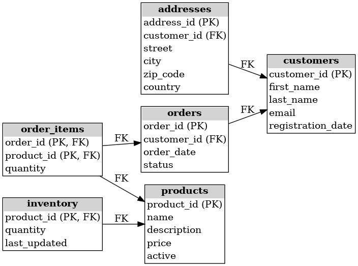

# 🛒 Baza danych e-commerce – Diagram ERD

Projekt przedstawia strukturę bazy danych dla prostego systemu sklepu internetowego. Uwzględniono tabele: klienci, produkty, zamówienia, stan magazynowy i inne powiązane encje.

---

## 🧩 Diagram związków encji (ERD)

Poniżej znajduje się diagram ERD prezentujący główne tabele oraz relacje między nimi:

---

## 📋 Uwzględnione tabele

### 1. `customers` (klienci)
- `customer_id (PK)`
- `first_name`
- `last_name`
- `email`
- `registration_date`

### 2. `addresses` (adresy)
- `address_id (PK)`
- `customer_id (FK)`
- `street`
- `city`
- `zip_code`
- `country`

### 3. `products` (produkty)
- `product_id (PK)`
- `name`
- `description`
- `price`
- `active`

### 4. `inventory` (magazyn)
- `product_id (PK, FK)`
- `quantity`
- `last_updated`

### 5. `orders` (zamówienia)
- `order_id (PK)`
- `customer_id (FK)`
- `order_date`
- `status`

### 6. `order_items` (pozycje zamówień)
- `order_id (PK, FK)`
- `product_id (PK, FK)`
- `quantity`

---

## 🔗 Relacje

- `addresses.customer_id` → `customers.customer_id`
- `inventory.product_id` → `products.product_id`
- `orders.customer_id` → `customers.customer_id`
- `order_items.order_id` → `orders.order_id`
- `order_items.product_id` → `products.product_id`

---

## 🧠 Uwagi

- Wszystkie tabele wykorzystują `INT` jako klucz główny (`AUTO_INCREMENT`).
- Klucze obce należy dodać oddzielnie za pomocą `ALTER TABLE`.
- Diagram został wygenerowany automatycznie z użyciem biblioteki `graphviz`.

---

## 📌 Zastosowanie

- Dokumentacja struktury bazy danych
- Nauka modelowania relacyjnego
- Materiał pomocniczy do projektów i ćwiczeń

